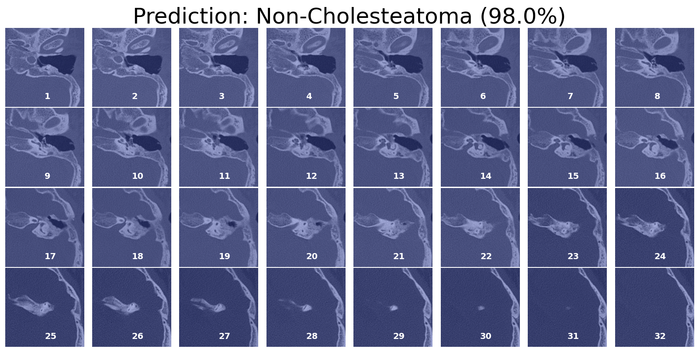

# Automatic Evaluation of Chronic Otitis Media (COM) Model

This repository contains the machine learning model for automatic evaluation of Chronic Otitis Media (COM) using temporal bone CT scans. The model is designed to assist clinicians and researchers in diagnosing COM and its subtypes, such as chronic suppurative otitis media (CSOM) and cholesteatoma.

## Description

The COM evaluation model employs a convolutional neural network (CNN) architecture optimized for analyzing three-dimensional (3D) medical imaging data. It provides an end-to-end diagnostic tool capable of processing raw CT images to classify and differentiate various forms of COM.

## Repository Primary Contents 

- `tutoral.ipynb`: Jupyter notebooks with examples and usage instructions.
- `run_full_workflow.py`: the python script that take DICOM image and generate output. 
- `scripts/`: Source code for model evaluation, and deployment.
- `Model_weights/`: the pretrained deep learning model weights for application.
- `environment.yml`: List of Python packages installed with conda.
- `requirements.txt`: List of Python dependencies for setting up the environment.

## Installation

To set up your environment to run the model, follow these steps:

1. Clone the repository:

`git clone https://github.com/huntlylee/3D-Otitis-Media.git`

2. Navigate to the repository directory:

`cd 3D-Otitis-Media`

3. Install the required Python packages:

`conda env create -f environment.yml`
`conda activate otitis`
`pip install -r requirements.txt`

## Tutorial

Please walk through the tutorial.ipynb to get detailed information on the workflow execution and how the arguments are set up and utilized.

## Usage
Run the full workflow script with the following command:

```bash
python run_full_workflow.py [OPTIONS]

Usage: python run_full_workflow.py [OPTIONS]
Set the path configurations with specified command-line arguments.

Options:
    --out_root_folder=PATH     Path to the output root folder. Default is 'output'.
    --scan_root_folder=PATH    Path to the root folder containing CT images. Default is 'CT_images'.
    --scan_id=ID              Identifier for the scan. Default is 'p00726056-231124'.
    --target_side=SIDE        Target side. Options are 'Left' or 'Right'. Default is 'Left'.
    --view_ch=CHANNEL         Model channel configuration, 1 for cholesteatoma, 0 for non-cholesteatoma. Default is 1.
    --optimal_threshold=VALUE Heatmap threshold for visualization. Default is 0.45.

Example:
    python run_full_workflow.py --out_root_folder=output --scan_root_folder=CT_images --scan_id=p00726123 --target_side=Left --view_ch=1 --optimal_threshold=0.45
```



## Contributing

Contributions to improve the model or its implementation are welcome. Please feel free to fork the repository, make changes, and submit a pull request.

## Citation

If you use this model or the associated code in your research, please cite the following paper:

[Author(s), "Title of the Paper", Journal/Conference, Year]

## License

This project is licensed under the [LICENSE NAME] - see the `LICENSE` file for details.

## Contact

For any queries or requests regarding the dataset or further collaboration, please contact the corresponding authors.

## Acknowledgments

We would like to thank all contributors to this project and the institutions that provided the datasets used for training the model.
